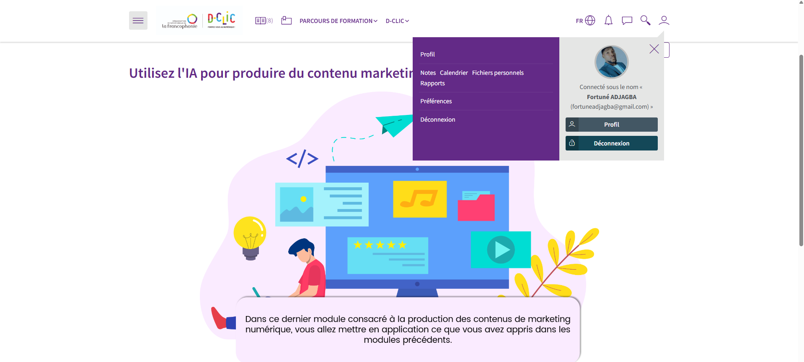
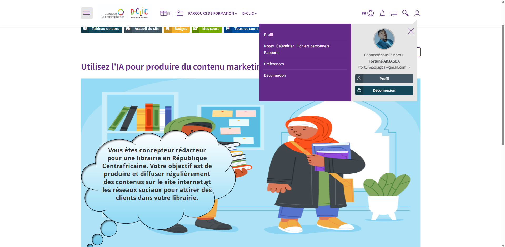
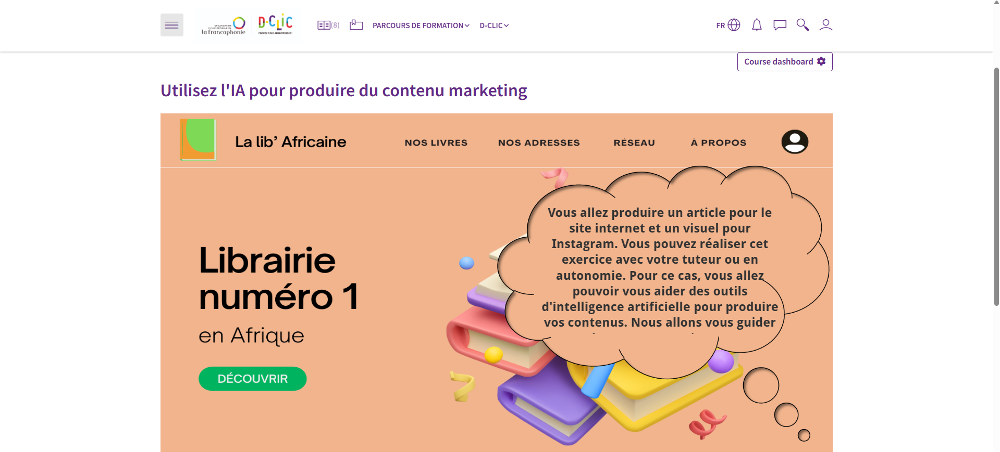
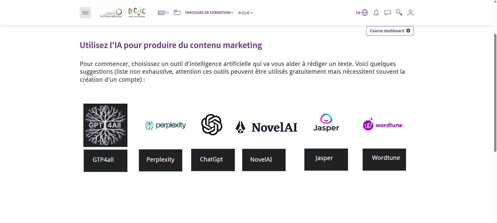
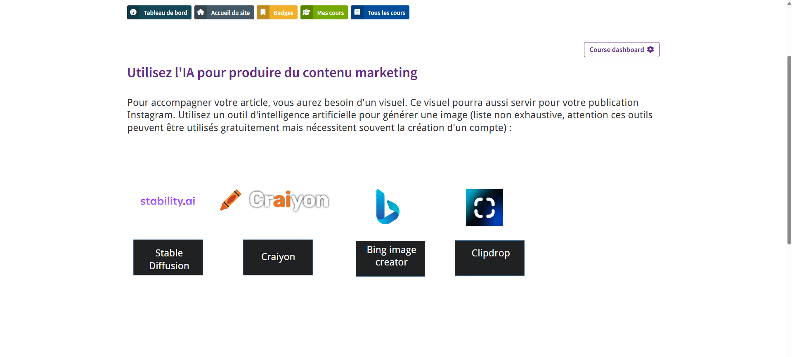

# Utilisation de l'IA pour la Production de Contenu Marketing

Ce dépôt documente un cas pratique réalisé dans le cadre du module **"Utilisez l'IA pour produire du contenu marketing"** du programme D-CLIC OIF.

Il s'agit d'une simulation de rôle de **Concepteur-Rédacteur** dont l'objectif est de produire du contenu social media pour une librairie située en **République Centrafricaine (RCA)**.

 
 
 
 
 

---

## Objectifs et Livrables

L'exercice visait l'utilisation d'outils d'IA pour optimiser la création du livrable demandé.

| Livrable | Canal de Diffusion | Outils d'IA utilisés |
| :--- | :--- | :--- |
| **Visuel Instagram (1080 x 1350 px)** | Instagram | **GPT** (pour le texte) et **Bing Image Creator** (pour la génération d'images des auteurs africains). |

---

## 🛠️ Outils & Techniques Mises en Œuvre

* **Génération d'Image par IA** : Utilisation de **Bing Image Creator** pour obtenir des visuels libres de droits adaptés au thème de la littérature africaine.
* **Prompt Engineering (Rédaction)** : Mobilisation de **GPT** pour générer des accroches textuelles marketing pour le visuel.
* **Stratégie de Contenu** : Création d'un contenu adapté aux formats de diffusion (format vertical Instagram).
* **Conception Visuelle** : Finalisation du visuel sur l'outil Canva pour respecter l'identité de marque.

---

#### 📂 Visuel du projet

Visuel produit Instagram (1080 x 1350 px) LIB'AFRICAINE avec l'aide de l'IA.

